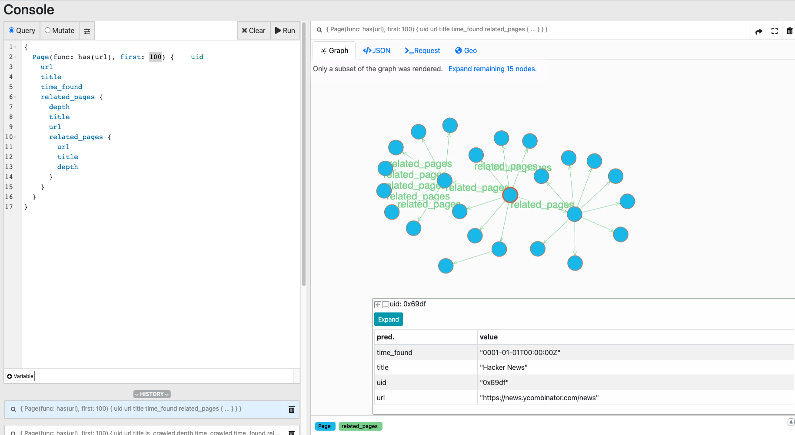

Too lazy to explain this one. Just read the code.

But here's a quick rundown:
- `Spider` is a struct that represents a worker. It can "crawl", "fetch_page", and "add_related_pages"
- `Index` is the shared data structure that holds all the data
- `Page` is a struct that represents a page

This is the state diagram of a Spider

In the UI you can see the graph of the pages that were crawled

